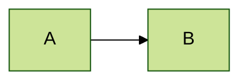

```mermaid
%%{init: {"securityLevel": "loose", "theme": "forest"}}%%
flowchart LR
  A --> B
  click A call alert(1)
  click B href "javascript:alert(2)"
```

Formula with a link: $\href{https://example.invalid}{x}$
