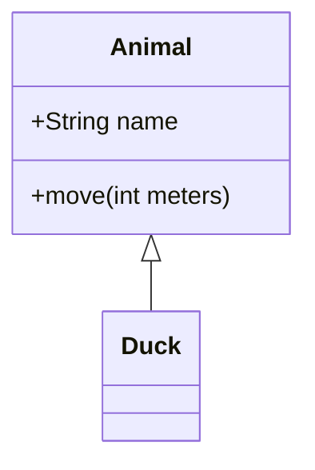
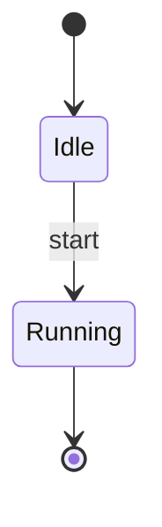

```mermaid
classDiagram
  class Animal {
    +String name
    +move(int meters)
  }
  Animal <|-- Duck
```

```mermaid
stateDiagram-v2
  [*] --> Idle
  Idle --> Running : start
  Running --> [*]
```
